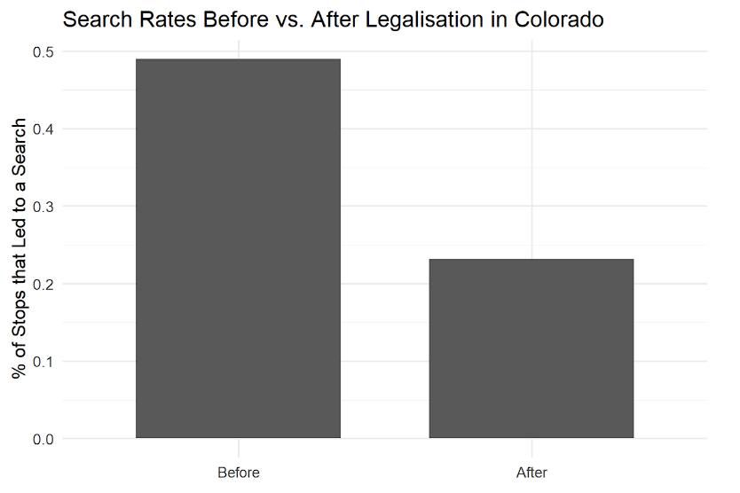
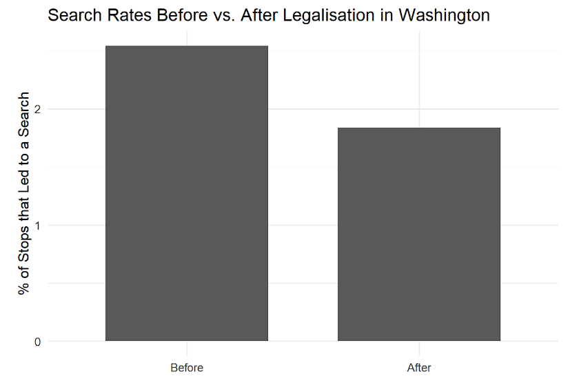
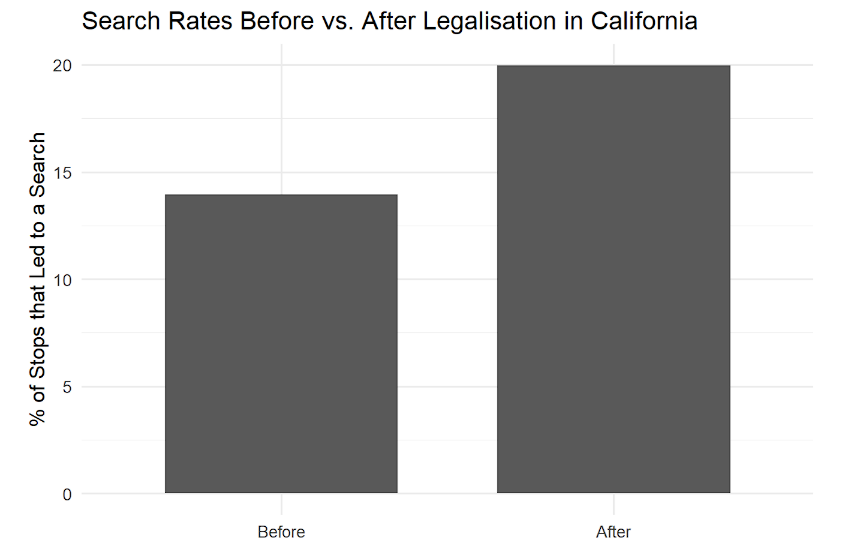
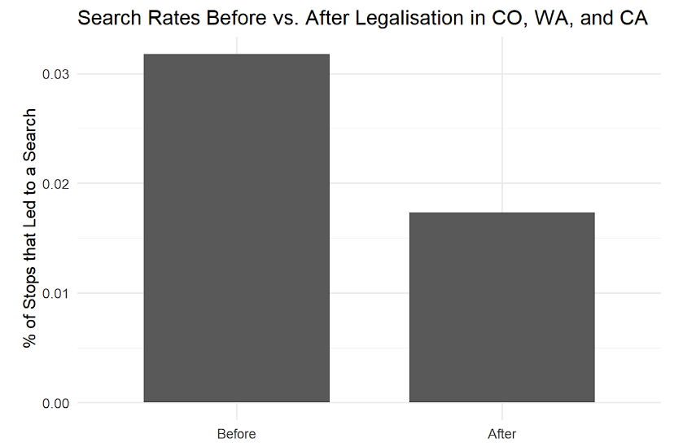
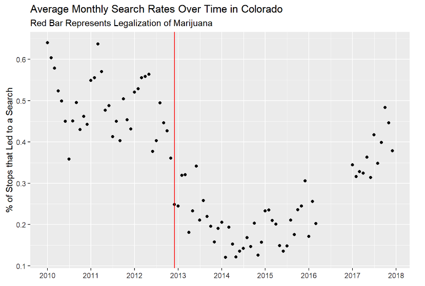
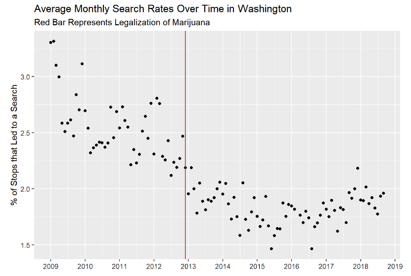
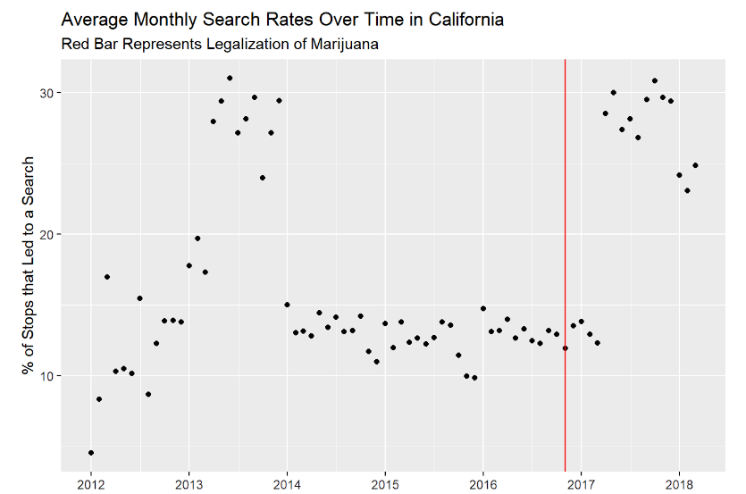

## Introduction

This analysis uses data from the [Stanford Open Policing Project](https://openpolicing.stanford.edu/), which works to create “a comprehensive, national repository detailing interactions between police and the public.”

The database includes standardized data on traffic stops (vehiclular and pedestrian) from law enforcement departments from 42 states.

[Citation:]{.underline}

Pierson, Emma, Camelia Simoiu, Jan Overgoor, Sam Corbett-Davies, Daniel Jenson, Amy Shoemaker, Vignesh Ramachandran, et al. 2020. “A Large-Scale Analysis of Racial Disparities in Police Stops Across the United States.” *Nature Human Behaviour*, 1–10.

## The Data

One area of interest in the data is regarding vehicular searches.

-   \~50% of the SOPP datasets include information on whether or not a search was conducted

-   Vehicular searches are often prompted by suspicion of possession of illicit drugs

My analysis focuses on this question: Does the legalization of marijuana affect vehicle search rates?

## Methods

-   Used data from three states (CO, WA, CA) which had data from both pre- and post-legal periods

-   Used SQL code to filter the data, calculating search rates from before and after legalization in each state, in addition to calculating monthly search rates

-   Used ggplot to create graphs displaying the changes in search rates

## Preliminary Findings

{width="70%"}

## Preliminary Findings

{width="70%"}

## Preliminary Findings

{width="70%"}

## Preliminary Findings

{width="70%"}

## Preliminary Findings

-   Colorado and Washington saw nearly 50% decreases in search rates after legalization

-   California saw a 50% increase in vehicular searches

-   Likely due to differences in data source

    -   CO and WA data were taken from state patrol on highways

    -   CA data was compiled from police departments within cities

## Analysis Continued

-   Difficult to determine from the data if marijuana legalization led to decreased search rates

-   Want to see impact of legalization of marijuana on search rates with greater granularity

-   Month-by-month analysis more clearly shows the trends previously revealed

## Analysis Continued

{width="70%"}

-   Clear decline in search rates after the legalization of marijuana

## Analysis Continued

{width="70%"}

## Analysis Continued

-   WA saw similar decreases in search rates after the legalization of marijuana

-   Could have been part of larger trend of decreasing search rates since search rates were already decreasing before legalization

## Analysis Continued

{width="70%"}

## Analysis Continued

-   California analysis combined data from three different Californian cities

-   This amalgamation seems to have affected the analysis

## Limitations

-   Doesn’t recognize the possible changes in searches due to other reasons, such as falling crime or changes in policing practices

-   Data is limited to only certain cities in CA, while CO and WA use state patrol data

    -   Different policing practices among these groups could create greater discrepancies

-   Far fewer data points in CA than CO and WA

    -   Not a lot of data from states that have recently legalized

## Further Exploration

-   Could compare the results to states which have not legalized recreational marijuana to isolate the impact of policy on traffic searches

-   Could explore how search rates vary across groups by race
